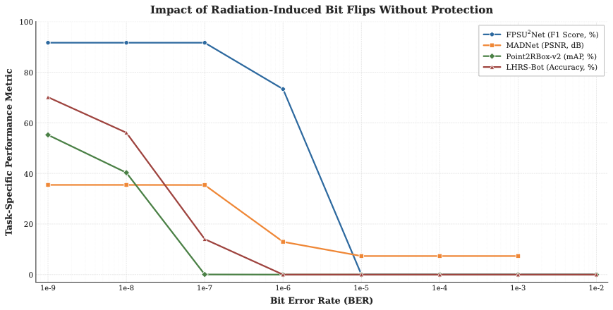
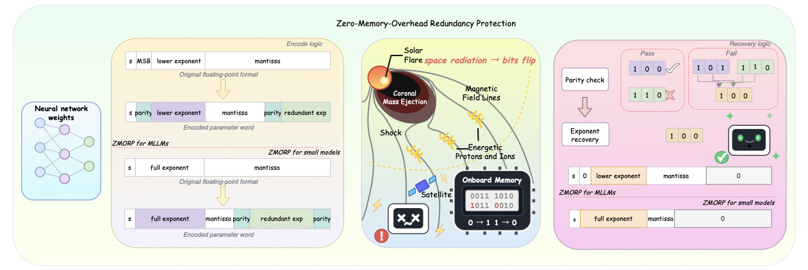
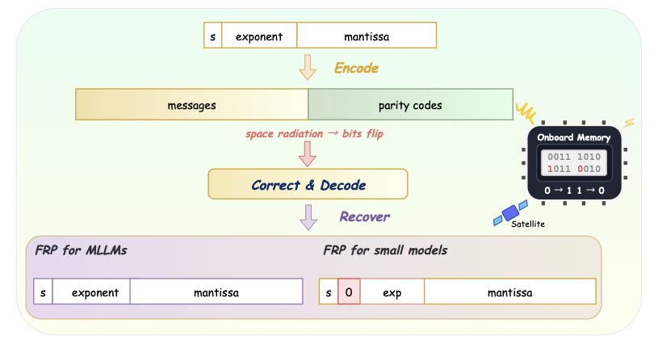
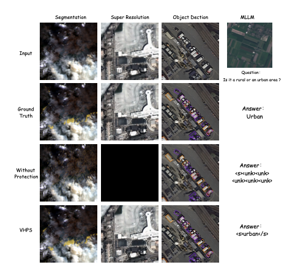

# VHPS: A Vulnerability-Aware Hybrid Protection Framework for Space-Borne Remote Sensing Models
Official PyTorch implementation of **VHPS**, an algorithm-level fault-tolerance framework that protects the weights of space-borne remote sensing models against radiation-induced bit flips.

> **Paper status:** *VHPS: A Vulnerability-Aware Hybrid Protection Framework for Space-Borne Remote Sensing Models* has been submitted to **IEEE Transactions on Geoscience and Remote Sensing (TGRS)**.  
> **Manuscript:** [Download the submitted PDF](./VHPS_TGRS.pdf)

## Why VHPS?

Neural networks deployed on satellites operate in radiation-prone environments. Even a small number of bit flips in model weights can propagate through the network and cause severe performance degradation across segmentation, super-resolution, object detection, and multimodal understanding tasks.

<p align="center">
  
</p>

VHPS protects a model according to the vulnerability of its modules instead of applying the same level of redundancy everywhere. It combines two complementary mechanisms:

- **ZMORP — Zero-Memory-Overhead Redundancy Protection.** Stores parity and redundant exponent information inside available mantissa bits, enabling exponent-error detection and recovery without increasing the parameter footprint.
- **FRP — Full Redundancy Protection.** Encodes each protected weight into a longer codeword and can correct up to **three bit errors per codeword**.
- **Vulnerability-aware hybrid protection.** Assigns FRP to the most vulnerable modules and ZMORP to moderately vulnerable modules, balancing robustness and storage cost.

## Method at a Glance

### ZMORP

ZMORP reuses selected mantissa bits to hold lightweight error-correction information. At recovery time, parity checks detect corruption and the redundant exponent bits restore the protected value.

<p align="center">
  
</p>

### FRP

FRP appends parity codes to the original weight representation. When radiation-induced bit flips corrupt the stored codeword, the decoder uses this redundancy to correct the errors and recover the protected parameter.

<p align="center">
  
</p>

Together with module-level vulnerability analysis, ZMORP and FRP form the complete VHPS pipeline. Protection and recovery are performed entirely at the algorithm level and do not require hardware self-checking support.

## Qualitative Results

The following examples cover four representative remote sensing tasks under a high bit-error rate. Without protection, corrupted weights lead to missing segmentation regions, degraded reconstruction, incorrect detections, and broken multimodal responses. VHPS substantially restores the original outputs.

<p align="center">
  
</p>

## Repository Structure

| File | Description |
| --- | --- |
| `eject_error.py` | Injects random bit errors into model weights for evaluation at a specified bit-error rate (BER). |
| `zmorp_little_model.py` | Standalone ZMORP implementation for small models. |
| `zmorp_large_model.py` | Standalone ZMORP implementation for large models. |
| `frp_little_model.py` | Standalone FRP implementation for small models. |
| `frp_large_model.py` | Standalone FRP implementation for large models. |
| `vhps_little_model.py` | Combined VHPS pipeline for small models. |
| `vhps_large_model.py` | Combined VHPS pipeline for large models. |

Use the `little` implementation for smaller networks and the `large` implementation for models that require the corresponding large-model protection path.

## Requirements

- Python 3.10+
- PyTorch (CUDA is recommended)
- tqdm

Install the runtime dependencies with:

```bash
pip install torch tqdm
```

## Quick Start

### 1. Inject bit errors

Use the fault injector to evaluate an unprotected or protected model under a controlled BER:

```python
from eject_error import inject_error_to_model

inject_error_to_model(model, ber=BER, seed=SEED)
```

### 2. Protect and recover with VHPS

Provide the model modules identified as vulnerable. VHPS applies its hybrid protection strategy to those modules:

```python
from vhps_little_model import protect, recover

vulnerable_layers = ["YOUR_VULNERABLE_LAYERS"]

protect(model, layer=vulnerable_layers, device="cuda")

# Run fault injection or deploy the protected model here.

recover(model, layer=vulnerable_layers, device="cuda")
```

### 3. Use ZMORP independently

```python
from zmorp_little_model import ZMORP

ZMORP.protect_model(model)
ZMORP.recover_model(model)
```

### 4. Use FRP independently

```python
from frp_little_model import FRP

frp = FRP(device="cuda")
frp.encode(model)
frp.decode(model)
```

For large models, replace the `*_little_model` imports with their `*_large_model` counterparts.

## Citation

The paper is currently under submission. Citation information will be added after publication. In the meantime, please refer to the [submitted manuscript](./VHPS_TGRS_manuscript.pdf).

## Contact

For questions about the code or paper, please open an issue in this repository.
